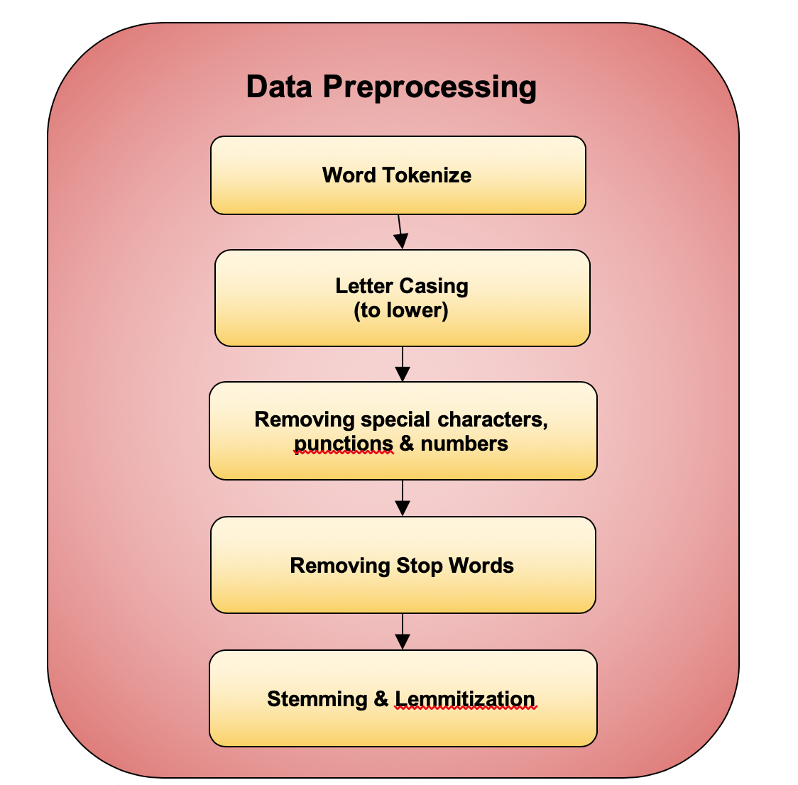
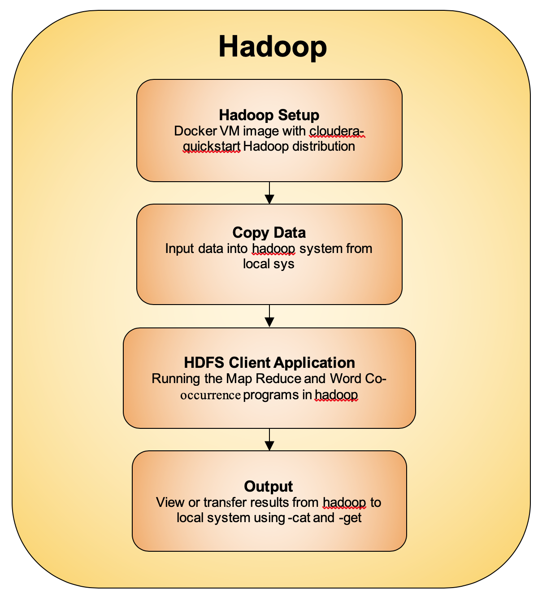

# Big-Data-Analysis-using-MapReduce-in-Hadoop
We explore data by using Big Data Analysis and Visualization skills. To obtain this, we perform 3 main operations. i.e. 
1.  Data Aggregation through different sources. 
2.  Big Data Analysis using MapReduce
3.  Visualization through Tableau.

## Introduction
Data Analysis is very critical in understanding the data, and what we can do with the data. For small datasets it is easier to process and obtain the results. But as for big companies, it becomes crucial for them to obtain the trends of the company for any changes need to be made. Hence we introduce Big Data Analysis to solve this problem. In this lab, we collect close to 20000 tweets, 500 articles on New York Times and 500 articles on Common Crawl Data about Entertainment, which is our main topic of discussion. Using this data, we perform preprocessing and feed it to a MapReduce to find the Word Count and Word Co-Occurrence. Using this, we find the trend of the data collected in this topic. We have used Python to perform Data Analysis.

<p align="center">
  <br><br>
  
  <figcaption><p align="center">Data Pipeline</p></figcaption>
</p>

## Data Collection
The first step in Data Analysis is to collect the data. Here, we are considering data from different sources such as tweets from Twitter, articles from New York Times and articles through Common Crawl. The data collected is related to Entertainment. To get more data regarding our topic, we have subdivided the topic into Movies, Games, Music, Books and Television.

<p align="center">
  <br><br>
  
  <figcaption><p align="center">Data Collection</p></figcaption>
</p>

### Twitter Data
To collect Twitter data, we are using the Tweepy API which is available in Python. We set up a developer account for Twitter to generate the API Keys for Tweepy. Data is collected related to the sub-topics as our hashtags, as the Tweepy API uses hashtags to identify the tweets. While collecting the tweets, we are filtering them to retrieve data which is in English and does not contain Retweets. 

### New York Times Data
The New York Times(NYT) is one of the most influencing newspapers in the world. Hence we are using NYT articles as one of our sources for data. We are using articleAPI from the nytarticleapi which is available using a Developer account for NYT. Using the search function, we query the list of articles through a key word. This gives us the list of URLs related to the topic specified.  
We are using Beautiful Soup to retrieve the content of the links, which will be parsed using the tags of the html file. Hence we parse the content using the 'p' tags and retrieve only the text data in the links. This is sum up to be our article for each link.

### Common Crawl Data
Common Crawl(CC) is a Web Crawler used to store data present on the web. CC stores their crawl data using a Web ARChive(WARC) format. It collects data over a week and is publically available to us. Hence we are using CC to collect data about Entertainment. 
We have crawled the data for indices in March and Feb 2019. We are filtering the web URLs based on the domain of the different sub topics. The domain names we used are “gamespot”,”billboard”,”newyorker” and ”cinemablend”. Using these domains we extracted the JSON list which has the records. With this, we requested for the set of links present in the Amazon S3 and extracted the GZIP file to retrieve the set of links. The links where then used to find the external links using Beautiful Soup by parsing ```<a>``` tags. This lead us to find relevant sources for articles in the Common Crawl Dataset. We then used Beautiful Soup again to extract the text of the links using ``` <p> ``` tags. Hence we stored each link and extracted the data to form the article data and stored them for future use. 

## Data Cleaning
In this process, we have to filter the data to provide only relevant and useful words. These are the steps we followed to clean the data.

1.  <b>Tokenizing</b> : Split the sentences in to words.
2.  <b>Remove Casing</b> : Convert all words to lower case. 
3.  <b>Remove Special Characters and Punctuation</b> : Removing punctuation and Special Characters.
4.  <b>Remove Numbers</b> : Deleting all numbers in the data.
5.  <b>Remove Stop Words</b> : Remove all the Stop Words such as <i>a, an, is , are</i>, etc. 
6.  <b>Stemming and Lemmatization</b> : We extract only the root word by performing Stemming and Lemmatization using NLTK.
7.  <b>Combining Words</b> : After cleaning, we convert the words back to the sentences and write them to a file.

<p align="center">
  <br><br>
  
  <figcaption><p align="center">Data Preprocessing</p></figcaption>
</p>

## Map Reduce

To process our huge data, we use a framework called MapReduce which works on large clusters of commodity hardware. It is a processing technique for distruibuted computing on data. It consists of two parts:

1.  <b>Map</b> : Data is broken down into Tuples of ```<Key,Value>``` Pairs
2.  <b>Reduce </b>: Takes the Pairs and combines the data into a smaller set of tuples.

We are analyzing the data by performing Word Count and Word Co-Occurrence.

## Word Count

This algorithm is used to find the frequencies of the words in the Big Data.

1.  <b>Mapper</b> : Divides the sentences into words and emits ```<Word,1>``` to the Reducer for each word, which gives the count of the word.
2.  <b>Reduce</b> : Takes the ```<Word,1>``` Pair for all the same words and combines the count. Emits ```<Word, Word, Freq>```

### Word Co-Occurrence

This algorithm is used to find the Co – occurrences of the Top 10 Words found by the Word Count. Word co-occurrence is used to check the frequency of the current word w.r.t its neighbor words, to determine the relations between them. It shows is they are related to each other.

1.  <b>Mapper</b> : Divides the sentences into words and checks if the word is present in the Top 10 Words. If so, emits ```<(Word, adjacent Word), 1>``` Pair to the Reducer.
2.  <b>Reduce</b> : Takes the ```<(Word, adjacent Word), 1>``` Pair for all the same words and combines the count. Emits ```<(Word, Adjacent Word), Freq>```

To perform these operations, we need to have an infrastructure to store and process this huge data. Hence we use a Hadoop Infrastructure to perform Data Analysis.


## Hadoop Infrastructure

Hadoop is an open-source software framework for storing data and running application on clusters of commodity hardware. It provides massive storage, enormous processing power and handle concurrent tasks. 

<p align="center">
  <br><br>
  
  <figcaption><p align="center">Hadoop</p></figcaption>
</p>

### Setup

To store our Big Data, we use Hadoop in a Dockerazied Environment. Docker provides container software to create , deploy and run applications. For this lab, we use cloudera/quickstart as a container for running the MapReduce.  We map our local system path to the Hadoop File System using the below command.
```
$ docker run --hostname=quickstart.cloudera --privileged=true -t -i -v localpath:/src --publishall=true -p 8888 cloudera/quickstart /usr/bin/docker-quickstart
```

### Store Data in Hadoop
1.  We store the data and our input files inside the Hadoop File System by first creating folders inside the Hadoop to store the data. 
```
$ hadoop fs -mkdir /user/mahesh 
$ hadoop fs -mkdir /user/mahesh/MR 
$ hadoop fs -mkdir /user/mahesh/MR/input
```
2.  We then store the data into the input file of the Hadoop System
```
$ hadoop fs -put data.txt /user/mahesh/MR/input
```

### Run MapReduce

Once we place the data in the HDFS, we pass the Mapper and Reducer Code into the HDFS, to process the data. The data is fed into the Mapper as input and gives the corresponding <key,value> pair according to the MapReduce Algorithm mentioned above. The output of Mapper is then sorted by the Hadoop and then sent to the Reducer. This helps the reducer find all the same words together and emits the ```<Word,Freq>``` Pair.

### Transfer Output

The output of the reducer is then transferred from the HDFS to the local system by using -get.
```
$ hadoop fs –get /user/mahesh/MR/output/ /src/
```

## Data Analysis and Visualization
We get the output from the Hadoop MR and store it in the local system. We have 2 files for Word Count and Word Co-occurrence for each of our 3 Data sources. Hence for those 6 output files, we will generate a Word Cloud which showcases the frequent Words in our data.
<p align="center">
  <br><br>
  
  <figcaption><p align="center">Data Analysis and Visualization</p></figcaption>
</p>


### Tableau
To perform this task, we have used Tableau which is used to create visualization of data. In Tableau, we sort the data in descending order of the count and take the Top 10 Words. We then use these words to create a Word Cloud of the 10 words for all 6 Data Outputs. 


## Conclusion
From this project we can realize the importance of Hadoop, it simplfies processing of huge Big Data. In recent times, there have been a huge surge in the need for Big Data and it processing which Hadoop provides. It implements parallel processing and thus reduces the overhead quantifiably.

In the next part of the lab, we have used the results to analyze the data. Analyzing data through word clouds makes it simpler to visualize and present data. The word count program gave us the most frequently occurring words, which implied the current trends w.r.t our topic Entertainment. Similarly the word co-occurrence program gave us results that showed some very relevant terms that would be used together. 

For example our topic had movie, music, film ,series, season as top frequent words and the co-occurrence music-award, movie-marvel, game-throne implied the latest trending movie and tv series and season, award shows.
Such a model could easily be applied to a number of domains for example Medical domain to see current diseases, illness or Social media to check trending trends, or track latest technologies.

 
